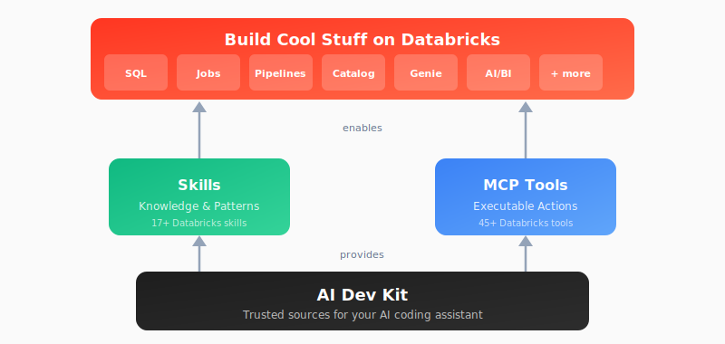

# Databricks AI Dev Kit

<p align="center">
  
</p>

---
> 🔒 Proactive Dependency Security  
> As part of our commitment to supply chain integrity, we continually monitor our dependency tree against known vulnerabilities and industry advisories. In response to a recently disclosed supply chain incident affecting litellm versions 1.82.7–1.82.8, we have audited our packages and removed the litellm dependency for most usage. It is solely used in the test directory for skills evaluation and optimization, and has been pinned to a safe version.  
> For full third-party attribution, see NOTICE.txt.
---

## AI-Assisted Development on Databricks

Databricks offers two paths for AI-assisted coding. Choose the one that matches your environment.

<table>
<tr>
<td width="50%" align="center" valign="top">

<br>


<br><br>

**Free, first-party AI coding inside Databricks**

Built into every Databricks workspace at no extra cost, with deep native product context — your notebooks, jobs, and Unity Catalog data are already in scope. Ideal for users who have not started using AI-driven development tools or that are comfortable in Databricks.

</td>
<td width="50%" align="center" valign="top">

<br>


<br><br>

**Databricks expertise, in the editor you already use**

Curated by Databricks field experts. Brings the patterns, skills, and 75+ executable tools your AI assistant needs to build on Databricks — wherever you're already coding.

<br>


<br>
<sub>+ Antigravity · Windsurf · OpenCode · and more!</sub>

</td>
</tr>
<tr>
<td align="center">

<a href="https://docs.databricks.com/aws/en/genie-code/"></a>

<br>

</td>
<td align="center">

<a href="#install-in-existing-project"></a>

<br>

</td>
</tr>
</table>

---

## What Can I Build?

- **Spark Declarative Pipelines** (streaming tables, CDC, SCD Type 2, Auto Loader)
- **Databricks Jobs** (scheduled workflows, multi-task DAGs)
- **AI/BI Dashboards** (visualizations, KPIs, analytics)
- **Unity Catalog** (tables, volumes, governance)
- **Genie Spaces** (natural language data exploration)
- **Knowledge Assistants** (RAG-based document Q&A)
- **MLflow Experiments** (evaluation, scoring, traces)
- **Model Serving** (deploy ML models and AI agents to endpoints)
- **Databricks Apps** (full-stack web applications with foundation model integration)
- ...and more

---

## Choose Your Own Adventure

| Adventure                        | Best For | Start Here |
|----------------------------------|----------|------------|
| :star: [**Install AI Dev Kit**](#install-in-existing-project) | **Start here!** Follow quick install instructions to add to your existing project folder | [Quick Start (install)](#install-in-existing-project)
| [**Visual Builder App**](#visual-builder-app) | Web-based UI for Databricks development | `databricks-builder-app/` |
| [**Builder App + Genie Code MCP**](#visual-builder-app) | Builder UI + MCP server for Genie Code in one deployment | `deploy.sh --enable-mcp` |
| [**Core Library**](#core-library) | Building custom integrations (LangChain, OpenAI, etc.) | `pip install` |
| [**Skills Only**](databricks-skills/) | Databricks patterns and best practices (without MCP functions) | `databricks aitools install` |
| [**Genie Code Skills**](databricks-skills/) | Upload skills into your workspace for Genie Code | [Genie Code skills (install)](#genie-code-skills) |
| [**MCP Tools Only**](databricks-mcp-server/) | Just executable actions (no guidance) | Register MCP server |
---

## Quick Start

### Prerequisites

- [uv](https://github.com/astral-sh/uv) - Python package manager
- [Databricks CLI](https://docs.databricks.com/aws/en/dev-tools/cli/) **v1.0.0+** - Command line interface for Databricks (v1.0.0+ ships `databricks aitools`, which installs most skills)
- AI coding environment (one or more):
  - [Claude Code](https://claude.ai/code)
  - [Cursor](https://cursor.com)
  - [Gemini CLI](https://github.com/google-gemini/gemini-cli)
  - [Antigravity](https://antigravity.google)
  - [Codex](https://openai.com/codex/)
  - [Copilot](https://github.com/features/copilot/cli)
  - [Windsurf](https://windsurf.com)
  - [OpenCode](https://opencode.ai)
  - [Kiro](https://kiro.dev)


### Install in existing project
By default this will install at a project level rather than a user level. This is often a good fit, but requires you to run your client from the exact directory that was used for the install.
_Note: Project configuration files can be re-used in other projects. You find these configs under .claude, .cursor, .gemini, .codex, .github, .agents, .windsurf, .codeium, .opencode, .kiro, or opencode.json_

#### Mac / Linux

**Basic installation** (uses DEFAULT profile, project scope)

```bash
bash <(curl -sL https://raw.githubusercontent.com/databricks-solutions/ai-dev-kit/main/install.sh)
```

<details>
<summary><strong>Advanced Options</strong> (click to expand)</summary>

**Global installation with force reinstall**

```bash
bash <(curl -sL https://raw.githubusercontent.com/databricks-solutions/ai-dev-kit/main/install.sh) --global --force
```

**Specify profile and force reinstall**

```bash
bash <(curl -sL https://raw.githubusercontent.com/databricks-solutions/ai-dev-kit/main/install.sh) --profile DEFAULT --force
```

**Install for specific tools only**

```bash
bash <(curl -sL https://raw.githubusercontent.com/databricks-solutions/ai-dev-kit/main/install.sh) --tools cursor,gemini,antigravity,windsurf,opencode
```

</details>

**Next steps:** Respond to interactive prompts and follow the on-screen instructions.
- Note: Cursor and Copilot require updating settings manually after install.

#### Windows (PowerShell)

**Basic installation** (uses DEFAULT profile, project scope)

```powershell
irm https://raw.githubusercontent.com/databricks-solutions/ai-dev-kit/main/install.ps1 | iex
```

<details>
<summary><strong>Advanced Options</strong> (click to expand)</summary>

**Download script first**

```powershell
irm https://raw.githubusercontent.com/databricks-solutions/ai-dev-kit/main/install.ps1 -OutFile install.ps1
```

**Global installation with force reinstall**

```powershell
.\install.ps1 -Global -Force
```

**Specify profile and force reinstall**

```powershell
.\install.ps1 -Profile DEFAULT -Force
```

**Install for specific tools only**

```powershell
.\install.ps1 -Tools cursor,gemini,antigravity
```

</details>

**Next steps:** Respond to interactive prompts and follow the on-screen instructions.
- Note: Cursor and Copilot require updating settings manually after install.

### Where Skills Come From

The installer assembles skills from four sources:

| Source | Skills | Mechanism |
|--------|--------|-----------|
| [databricks/databricks-agent-skills](https://github.com/databricks/databricks-agent-skills) | Most Databricks skills (jobs, pipelines, DABs, SQL, Unity Catalog, apps, …) | Delegated to `databricks aitools install` — requires **Databricks CLI v1.0.0+** |
| This repo | `databricks-genie` | Bundled copy |
| [mlflow/skills](https://github.com/mlflow/skills) | 8 MLflow skills | Fetched from `main` (override with `MLFLOW_REF`) |
| [databricks-solutions/apx](https://github.com/databricks-solutions/apx) | `databricks-app-apx` | Fetched from the latest stable tag (override with `APX_REF`) |

Skills installed via `databricks aitools` are managed by the CLI afterwards — update them with `databricks aitools update` and remove them with `databricks aitools uninstall`. For tools the CLI can't target yet (Gemini CLI, Windsurf, Kiro), the installer links the same skills into each tool's skills directory.

Use `--list-skills` to see every skill and profile, and `--dry-run` to preview exactly what an install would do (resolved refs and the `aitools` command) without changing anything.

> **Breaking change:** skills now use the `databricks-agent-skills` names. `databricks-bundles` → `databricks-dabs`, `databricks-spark-declarative-pipelines` → `databricks-pipelines`; `databricks-config` is replaced by `databricks-core`, and `databricks-lakebase-autoscale`/`databricks-lakebase-provisioned` by `databricks-lakebase`. Explicit `--skills` requests for old names are migrated with a warning.

<details>
<summary><strong>Installer environment variables</strong> (click to expand)</summary>

| Variable | Default | Purpose |
|----------|---------|---------|
| `APX_REF` | `latest` | Ref for the APX skill fetch: `latest` (highest stable tag), a tag/SHA, or `main` |
| `MLFLOW_REF` | `main` | Ref for the MLflow skills fetch (the repo is tagless) |
| `SKILLS_CHANNEL` | `stable` | Set to `dev` to make unset raw-fetch refs follow `main` |
| `INCLUDE_PRERELEASES` | `0` | Set to `1` to allow `-rc`/`-beta` tags when resolving `latest` |
| `DRY_RUN` | `false` | Set to `1` to print the install plan and exit |

The installer also records what it installed (resolved refs, commit SHAs, `aitools` release) in `skills.lock` inside the scope-local `.ai-dev-kit/` state directory.

</details>

### Visual Builder App

Full-stack web application with chat UI for Databricks development. Deploys a Lakebase database and Databricks App with a single command:

```bash
cd ai-dev-kit/databricks-builder-app

# Deploy everything (Lakebase + app + permissions)
./scripts/deploy.sh my-builder-app --profile <your-profile>

# Deploy with MCP Gateway for Genie Code (name must start with mcp-)
./scripts/deploy.sh mcp-builder-app --enable-mcp --profile <your-profile>
```

With `--enable-mcp`, the app also serves as an **MCP server** at `/mcp`, exposing all 75+ Databricks tools to [Genie Code](https://docs.databricks.com/en/genie/genie-code.html), AI Playground, and other MCP clients. The builder UI and MCP server run in a single deployment.

For local development:

```bash
./scripts/setup.sh        # Install dependencies
# Edit .env.local with your credentials
./scripts/start_dev.sh    # Start locally at http://localhost:3000
```

See [`databricks-builder-app/`](databricks-builder-app/) for full documentation.


### Core Library

Use `databricks-tools-core` directly in your Python projects:

```python
from databricks_tools_core.sql import execute_sql

results = execute_sql("SELECT * FROM my_catalog.schema.table LIMIT 10")
```

Works with LangChain, OpenAI Agents SDK, or any Python framework. See [databricks-tools-core/](databricks-tools-core/) for details.

---
## Skills

Skills teach your AI assistant Databricks patterns and best practices. For your **editor**, they are
installed and kept up to date by the Databricks CLI (v1.0.0+), which the AI Dev Kit installer already
delegates to:

```bash
databricks aitools install
```

Skills come from [github.com/databricks/databricks-agent-skills](https://github.com/databricks/databricks-agent-skills).
The skill copies that used to be bundled in this repo are deprecated and frozen under
[`databricks-skills/deprecated/`](databricks-skills/deprecated/); if you need the exact historical
files, use git tag `v0.1.12`. Some skills were renamed in the move — see the breaking-change note
below. (APX and Genie-specific skills are no longer bundled here; they live in their own repos.)

### Genie Code Skills

To use skills inside **Genie Code** in a Databricks workspace, upload them to
`/Workspace/Users/<you>/.assistant/skills`. `databricks aitools install` does not cover this yet, so
use one of these:

**From a Databricks notebook (recommended — no local clone):**
Import [`databricks-skills/install_genie_code_skills.py`](databricks-skills/install_genie_code_skills.py)
into your workspace as a notebook and run it. It downloads skills from GitHub and uploads them via the
Databricks SDK. Works on any compute, including serverless.

**From a local checkout (deprecated fallback):** the
[`databricks-skills/install_skills.sh`](databricks-skills/install_skills.sh) script still supports the
upload flow. It sources the frozen legacy skill copies (from `databricks-skills/deprecated/` with
`--local`, or a `v0.1.12`-pinned download otherwise). Requires the
[Databricks CLI](https://docs.databricks.com/aws/en/dev-tools/cli/) authenticated for your workspace.

```bash
# Run from the directory where you want ./.claude/skills created
./databricks-skills/install_skills.sh --local --install-to-genie
./databricks-skills/install_skills.sh --install-to-genie --profile YOUR_PROFILE
```

See [databricks-skills/README.md](databricks-skills/README.md) for details.

**Customizing skills:** after upload, skills live under
`/Workspace/Users/<your_user_name>/.assistant/skills`. You can modify or remove skills there, or add
your own skill folders (each with a `SKILL.md`) that Genie Code will use automatically in any session.

### Breaking change: skill sources and names

Skills are no longer bundled in this repository. They now come from
[databricks-agent-skills](https://github.com/databricks/databricks-agent-skills) via
`databricks aitools install`, and some skills were **renamed or consolidated** in the move (for
example, several core skills are now installed together under `databricks-core`). To see the current
skill names, run `databricks aitools list` (CLI v1.0.0+) or browse the
[databricks-agent-skills](https://github.com/databricks/databricks-agent-skills) repo. To reproduce
the old bundled layout and names exactly, use git tag `v0.1.12` (the frozen copies also remain under
[`databricks-skills/deprecated/`](databricks-skills/deprecated/)).

## Architecture

The AI Dev Kit ships as four composable pieces — install the whole kit, or pick just the parts you need.

<p align="center">
  
</p>

## What's Included

| Component | Description |
|-----------|-------------|
| [`databricks-tools-core/`](databricks-tools-core/) | Python library with high-level Databricks functions |
| [`databricks-mcp-server/`](databricks-mcp-server/) | MCP server exposing 50+ tools for AI assistants |
| [`databricks-skills/`](databricks-skills/) | Skills that teach Databricks patterns (installed via `databricks aitools`; bundled copies are deprecated) |
| [`databricks-builder-app/`](databricks-builder-app/) | Full-stack web app with Claude Code integration |

---

## Star History

<a href="https://star-history.com/#databricks-solutions/ai-dev-kit&Date">
 <picture>
   <source media="(prefers-color-scheme: dark)" srcset="https://api.star-history.com/svg?repos=databricks-solutions/ai-dev-kit&type=Date&theme=dark" />
   <source media="(prefers-color-scheme: light)" srcset="https://api.star-history.com/svg?repos=databricks-solutions/ai-dev-kit&type=Date" />
   
 </picture>
</a>

---

## License

(c) 2026 Databricks, Inc. All rights reserved.

The source in this project is provided subject to the [Databricks License](https://databricks.com/db-license-source). See [LICENSE.md](LICENSE.md) for details.

<details>
<summary><strong>Third-Party Licenses</strong></summary>

| Package | Version | License | Project URL |
|---------|---------|---------|-------------|
| [fastmcp](https://github.com/jlowin/fastmcp) | ≥0.1.0 | MIT | https://github.com/jlowin/fastmcp |
| [mcp](https://github.com/modelcontextprotocol/python-sdk) | ≥1.0.0 | MIT | https://github.com/modelcontextprotocol/python-sdk |
| [sqlglot](https://github.com/tobymao/sqlglot) | ≥20.0.0 | MIT | https://github.com/tobymao/sqlglot |
| [sqlfluff](https://github.com/sqlfluff/sqlfluff) | ≥3.0.0 | MIT | https://github.com/sqlfluff/sqlfluff |
| [plutoprint](https://github.com/nicvagn/plutoprint) | ==0.19.0 | MIT | https://github.com/plutoprint/plutoprint |
| [claude-agent-sdk](https://github.com/anthropics/claude-code) | ≥0.1.19 | MIT | https://github.com/anthropics/claude-code |
| [fastapi](https://github.com/fastapi/fastapi) | ≥0.115.8 | MIT | https://github.com/fastapi/fastapi |
| [uvicorn](https://github.com/encode/uvicorn) | ≥0.34.0 | BSD-3-Clause | https://github.com/encode/uvicorn |
| [httpx](https://github.com/encode/httpx) | ≥0.28.0 | BSD-3-Clause | https://github.com/encode/httpx |
| [sqlalchemy](https://github.com/sqlalchemy/sqlalchemy) | ≥2.0.41 | MIT | https://github.com/sqlalchemy/sqlalchemy |
| [alembic](https://github.com/sqlalchemy/alembic) | ≥1.16.1 | MIT | https://github.com/sqlalchemy/alembic |
| [asyncpg](https://github.com/MagicStack/asyncpg) | ≥0.30.0 | Apache-2.0 | https://github.com/MagicStack/asyncpg |
| [greenlet](https://github.com/python-greenlet/greenlet) | ≥3.0.0 | MIT | https://github.com/python-greenlet/greenlet |
| [psycopg2-binary](https://github.com/psycopg/psycopg2) | ≥2.9.11 | LGPL-3.0 | https://github.com/psycopg/psycopg2 |

</details>

---

<details>
<summary><strong>Acknowledgments</strong></summary>

MCP Databricks Command Execution API from [databricks-exec-code](https://github.com/databricks-solutions/databricks-exec-code-mcp) by Natyra Bajraktari and Henryk Borzymowski.

</details>
